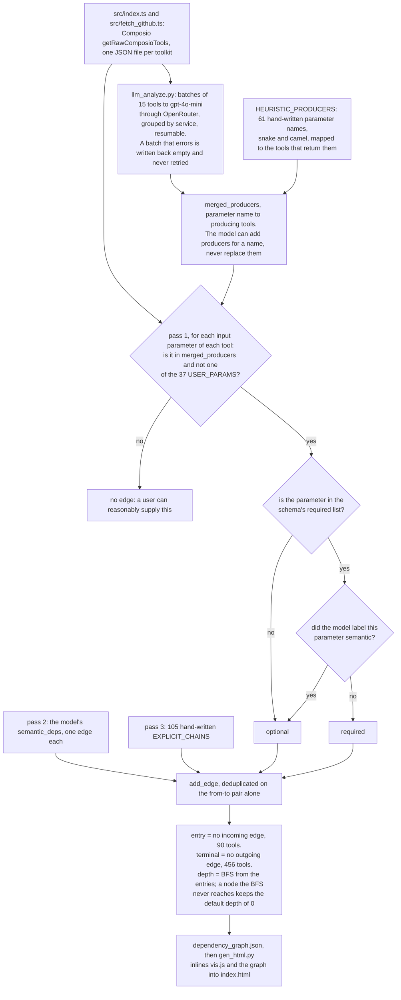

# Tool Dependency Graph

Which actions must run before other actions can execute, across Composio's Google
Super and GitHub toolkits, and what that ordering looks like as a graph.

Some tools cannot be called cold. `GMAIL_REPLY_TO_THREAD` needs a `thread_id`, which
something like `GMAIL_LIST_THREADS` has to produce first. "Send an email to Priya"
needs a contacts lookup before it needs a mail client. An agent executing these
actions has to know, ahead of time, whether a missing argument should be asked of the
user or fetched by another call.

This builds that graph: **677 tools, 3,039 dependency edges** across the two toolkits.

## What it produces

Every edge names the parameter that creates the dependency and classifies it:

| Edge type | Count | Meaning |
|---|---:|---|
| `required` | 2,837 | The parameter is mandatory and no user can reasonably supply it by hand |
| `optional` | 190 | The parameter refines the call but the call succeeds without it |
| `semantic` | 12 | No shared ID, but the intent implies an ordering (name to contact to email) |

Nodes carry a toolkit (431 GitHub, 246 Google Super), a BFS depth from the entry set,
and entry/terminal flags. Depth is what makes the layout readable rather than a hairball:
134 sit at depth 0, 454 one hop in, 82 two, 7 three. Depth 0 is not the same as
"needs nothing": only 90 tools have no incoming edge at all. The other 44 are nodes
the BFS never reached from the entry set, and they fall back to depth 0 rather than
being marked unreachable.

## How it decides

A purely heuristic pass over parameter names produces a lot of false edges, because
`id` in one tool is not `id` in another. A purely LLM pass is slow and unreproducible.
So it runs both:

1. **`fetch_github.ts`** pulls raw tool schemas through the Composio SDK.
2. **`llm_analyze.py`** batches tools to an LLM and asks three things per tool: which
   entity IDs its *output* produces, whether each required parameter is user-supplied
   or must come from another call, and whether any semantic ordering applies.
3. **`build_graph.py`** joins the LLM's producer mappings against the heuristic
   entity-type matches, classifies each edge, tags entry and terminal nodes, and
   computes BFS depth.
4. **`gen_html.py`** inlines vis.js and the graph into a single self-contained
   `index.html`.

The LLM proposes producer relationships; the schema decides whether an edge exists.
That ordering matters, because the model is confident about mappings that the actual
parameter list does not support.

## What makes an edge

Three passes write into one edge set, and the schema, not the model, has the last word.



Because the dedup key is the pair and not the parameter, only the first parameter to
connect two tools is recorded, and a hand-written chain in pass 3 is dropped when pass 1
already emitted that pair under a different name. The `param` on an edge is therefore one
reason the ordering exists, not the only one.

## Run it

```bash
bun install
COMPOSIO_API_KEY=... bun src/index.ts        # fetch Google Super tool schemas
COMPOSIO_API_KEY=... bun src/fetch_github.ts # fetch GitHub tool schemas
OPENROUTER_API_KEY=... python3 src/llm_analyze.py
python3 src/build_graph.py
python3 src/gen_html.py                      # writes index.html
```

Open `index.html` in a browser. Both `index.html` and `dependency_graph.json` are
checked in, so the graph can be read without re-running any of the above.

`gen_html.py` inlines `vis-network.min.js` from the repo root. That file is not checked
in, so regenerating the page means downloading it first:

```bash
curl -o vis-network.min.js https://unpkg.com/vis-network/standalone/umd/vis-network.min.js
```

## Limits

- Two toolkits only, Google Super and GitHub. Each is fetched by its own script
  (`src/index.ts`, `src/fetch_github.ts`), so a third needs one more of those.
- The `semantic` edges are the least reliable class and the smallest. They encode
  intent rather than a shared identifier, so they are the ones to audit first.
- Producer mappings come from a model reading a schema, not from executing the tool.
  An edge asserts that a tool's output *should* contain an entity, not that a live
  call was observed returning one.
